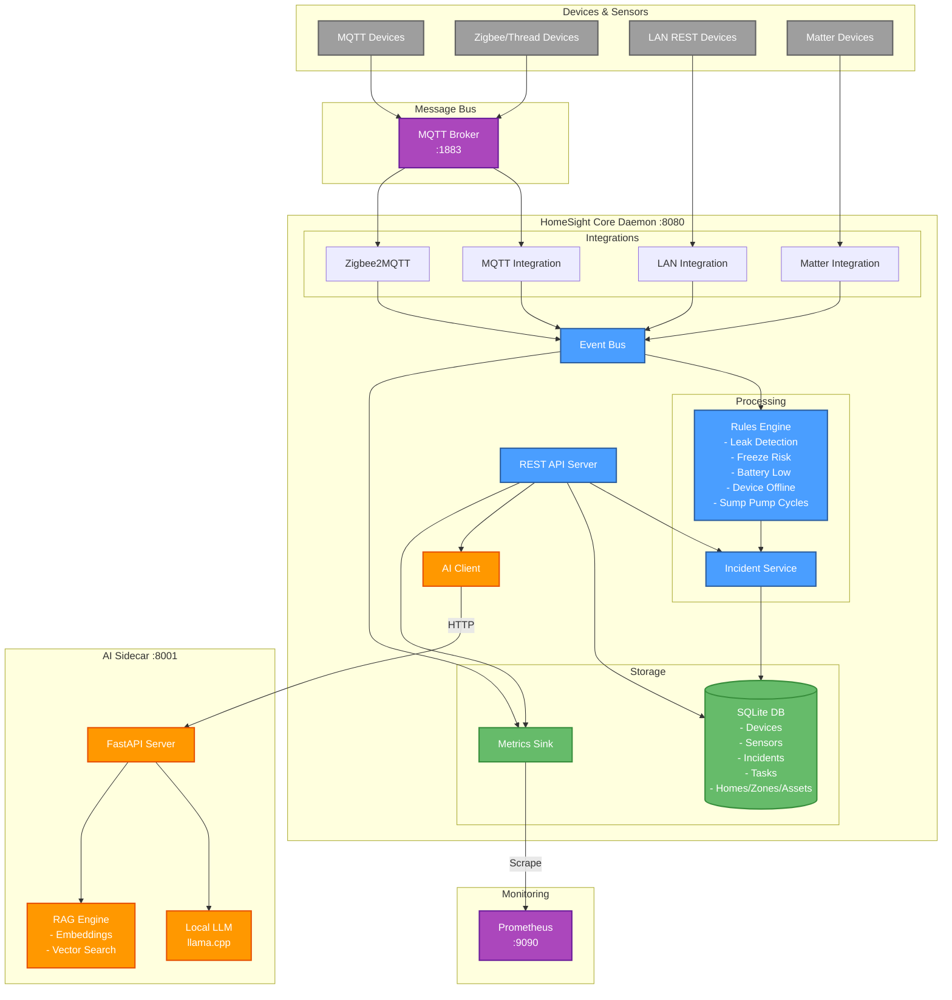

# HomeSight

Local-only home monitoring system. Detects leaks, freeze risks, battery issues, and more.

## What It Does

- Monitors sensors via MQTT, Zigbee2MQTT, or LAN devices
- Auto-creates incidents when problems are detected
- Auto-resolves incidents when conditions clear
- Stores everything locally in SQLite
- Optional AI analysis for recommendations

## Quick Start

```bash
# Build
make build

# Start everything
./scripts/homesight.sh start

# Run AI intelligence demo (RAG + auto-ingestion)
./scripts/demo-ai-intelligence.sh

# Open dashboard
./scripts/homesight.sh dashboard

# Check status
./scripts/homesight.sh status
```

## Running the Demo

### Sensor & Incident Demo

```bash
# Run interactive demo (simulates sensor lifecycle)
./scripts/demo-interactive.sh

# Clean up demo data
./scripts/cleanup-demo.sh
```

The demo creates:

- 6 test devices (leak sensor, sump pump, temperature sensors, door sensors)
- 2 incidents (water leak, low battery)

### AI Intelligence Demo

```bash
# Comprehensive AI demo (RAG + auto-ingestion)
./scripts/demo-ai-intelligence.sh
```

This interactive demo showcases:

**Part 1: RAG-Powered Analysis**
- Document retrieval from vector database
- Semantic search with relevance scoring
- Context-aware incident recommendations
- Transparent sourcing (shows which docs were used)
- Real examples: Water leak, freeze risk, device issues

**Part 2: Zero-Config Auto-Ingestion**
- Simulates device onboarding
- Automatic doc fetching via webhook
- Background processing (non-blocking)
- Verification that docs were indexed
- Incident analysis using auto-fetched docs

## Intelligent AI with RAG

HomeSight uses Retrieval-Augmented Generation (RAG) to provide context-aware incident analysis with **zero-configuration auto-ingestion**.

### How It Works

1. **Device Discovery**: When a new device is onboarded (Zigbee2MQTT, MQTT, etc.)
2. **Auto-Fetch**: AI service automatically fetches manufacturer documentation
3. **RAG Ingestion**: Documents are embedded into vector database (ChromaDB)
4. **Smart Analysis**: Incidents query RAG for relevant docs before providing recommendations

**Zero Config**: No manual doc downloads required! The system automatically:
- Detects device manufacturer and model from metadata
- Fetches manuals from manufacturer websites or templates
- Caches locally for offline use
- Ingests into RAG in the background

### Supported Manufacturers (Auto-Fetch)

- **Aqara**: Water leak sensors, temperature sensors, door/window sensors
- **Shelly**: Relays, sensors, smart plugs (coming soon)
- **Generic**: Fallback templates for common devices

Want more manufacturers? Contribute to the fetcher!

### Current Knowledge Base

- Aqara Water Leak Sensor Manual
- Aqara Temperature & Humidity Sensor Manual
- Aqara Door/Window Sensor Manual
- Emergency Plumbing Guide
- Water Heater Maintenance Manual
- International Residential Code (IRC) - Plumbing
- Home Winterization and Freeze Prevention Guide

More manuals are auto-fetched as devices are added!

### Manual Override (Optional)

For offline use or custom docs, you can pre-populate the cache:

```bash
# Add PDFs to cache
mkdir -p ~/.homesight/manuals/aqara
cp your-manual.pdf ~/.homesight/manuals/aqara/

# Check what's in RAG
curl http://localhost:8001/rag/status
```

The auto-fetcher checks cache first, so pre-downloaded docs are used immediately.

### Example RAG Response

```json
{
  "analysis": "Incident Analysis: Water Leak Detected (Severity: high) [Enhanced with 3 document(s)]",
  "insights": [
    "Water leak detected - potential for property damage",
    "Found 3 relevant maintenance guides",
    "📖 Plumbing Emergency Guide: Emergency actions for water leaks...",
    "📖 Aqara Water Leak Sensor Manual: Troubleshooting and maintenance..."
  ],
  "actions": [
    "Locate and shut off water source immediately",
    "Check for visible damage and call plumber if needed"
  ],
  "metadata": {
    "rag_sources": [
      {
        "source": "Plumbing Emergency Guide",
        "relevance": 0.654
      },
      {
        "source": "Aqara Water Leak Sensor Manual",
        "relevance": 0.369
      }
    ]
  }
}
```

## API Endpoints

### Health

```bash
curl http://localhost:8080/health
```

### Devices

```bash
# List all devices
curl http://localhost:8080/devices

# Get specific device
curl http://localhost:8080/devices/{id}
```

### Incidents

```bash
# List all incidents
curl http://localhost:8080/incidents

# List only open incidents
curl http://localhost:8080/incidents?status=open

# Get specific incident
curl http://localhost:8080/incidents/{id}

# Manually resolve incident
curl -X POST http://localhost:8080/incidents/{id}/resolve
```

## Architecture



## Auto-Resolution

Incidents automatically resolve when:

- **Leak sensors**: `leak=false` reported
- **Temperature**: Rises above freeze threshold (35°F)
- **Battery**: Level recovers above 20%

No manual intervention needed in production.

## Rules Engine

Built-in rules:

- **Leak Detection** - Creates critical incident when water detected
- **Freeze Risk** - High severity when temp < 35°F
- **Low Battery** - Medium severity when < 20%
- **Sump Pump Cycles** - Excessive cycling detection
- **Device Offline** - Alerts when device stops reporting

## Configuration

Edit `config.yaml`:

```yaml
server:
  port: 8080
  
database:
  path: "./data/homesight.db"
  
mqtt:
  enabled: true
  broker: "tcp://localhost:1883"
  
integrations:
  zigbee: false
  lan: false
```

## Control Script

```bash
./scripts/homesight.sh <command>

Commands:
  start              Start all services
  stop               Stop all services  
  restart [service]  Restart service(s)
  status             Show service status
  dashboard          Open TUI dashboard
  logs <service>     View service logs
```

## Dashboard

Interactive TUI with:

- Real-time device list
- Active incidents with severity colors
- Auto-refresh every 5 seconds
- Keyboard: `r` to refresh, `q` to quit

## Project Structure

```sh
homesight/
├── cmd/
│   ├── homesightd/      # Main daemon
│   └── dashboard/       # TUI dashboard
├── internal/
│   ├── api/             # REST API server
│   ├── db/              # SQLite repositories
│   ├── events/          # Event bus
│   ├── incidents/       # Incident service
│   ├── integrations/    # Device integrations
│   ├── metrics/         # Prometheus metrics
│   ├── model/           # Domain models
│   └── rules/           # Rules engine
├── ai-sidecar/          # Python AI service (optional)
├── scripts/             # Control scripts
├── data/                # SQLite database
└── config.yaml          # Configuration
```

## Requirements

- Go 1.25+
- Python 3.10+ (for AI sidecar)
- Docker (for MQTT broker)
- SQLite3

## Services

- **homesightd** - Main daemon (port 8080)
- **AI Sidecar** - Optional AI service (port 8001)
- **MQTT Broker** - Mosquitto (port 1883)
- **Prometheus** - Metrics (port 9090)

## Development

```bash
# Build daemon and dashboard
make build

# Run tests (TODO)
make test

# Clean build artifacts
make clean
```

## Adding Devices

Devices are auto-discovered via integrations. For manual testing:

```bash
# Create test device (demo only)
curl -X POST http://localhost:8080/devices \
  -H "Content-Type: application/json" \
  -d '{
    "id": "test-sensor-001",
    "name": "Test Sensor",
    "type": "water_leak",
    "integration": "mqtt",
    "enabled": true
  }'

# Delete test device
curl -X DELETE http://localhost:8080/devices/test-sensor-001
```

**Note**: In production, use auto-discovery instead of manual device creation.

## Troubleshooting

**Services won't start:**

```bash
./scripts/homesight.sh status
tail -f .logs/daemon.log
```

**Database issues:**

```bash
sqlite3 data/homesight.db
.tables
SELECT * FROM incidents WHERE status='open';
```

**MQTT connection failed:**

```bash
docker ps  # Check if mosquitto is running
docker logs homesight-mosquitto
```

## License

TBD
