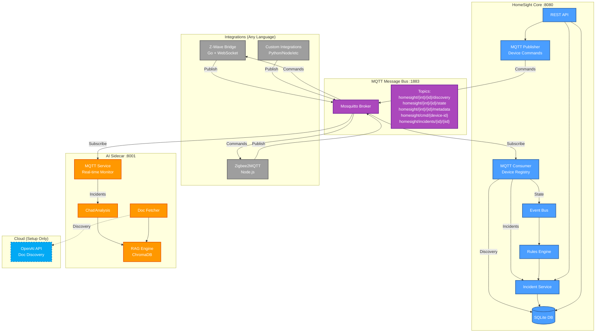
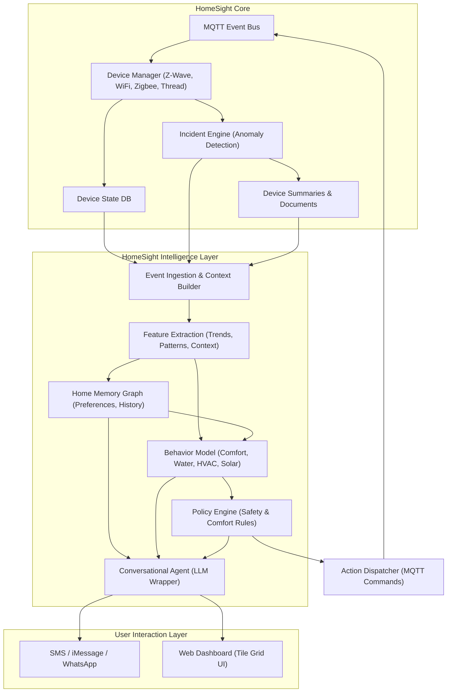

# HomeSight

Local-only home monitoring system. Detects leaks, freeze risks, battery issues, and more.

## Quick Start

```bash
make build
./scripts/homesight.sh start
./scripts/homesight.sh dashboard
```

**Services**: `http://localhost:8080` (main) | `http://localhost:8001` (AI, optional)

## Device Discovery

**MQTT-based Discovery:** All integrations publish device discovery messages to MQTT topics.

**Supported Integrations:**
- **Z-Wave** - Z-Wave JS devices via WebSocket bridge
- **Zigbee2MQTT** - Zigbee devices via MQTT (native support)
- **Custom** - Any device via MQTT topic: `homesight/{integration}/{id}/discovery`

**Discovery Flow:**
1. Integration publishes device discovery to MQTT
2. MQTT Consumer receives message
3. Device automatically registered in database
4. Appears in dashboard

**Configuration:** Edit `config.yaml` to enable integrations (currently Z-Wave and Zigbee2MQTT)

**Documentation:** See [docs/INTEGRATIONS_MQTT.md](docs/INTEGRATIONS_MQTT.md) for complete MQTT topic schema and integration guide.

## Demos

```bash
# Interactive demo (sensor lifecycle, incidents)
./scripts/demo-interactive.sh

# AI + RAG demo (if AI service running)
./scripts/demo-ai-intelligence.sh

# Cleanup
./scripts/cleanup-demo.sh
```

## AI Service (Optional)

Retrieval-Augmented Generation (RAG) for incident analysis.

**Flow:**

1. Device onboarded → AI service fetches manufacturer docs
2. PDFs cached locally and indexed into ChromaDB
3. Incidents query vector DB for relevant docs → LLM generates recommendations

**Auto-Fetch**: Uses OpenAI GPT-4o-mini to find manuals (~$0.001 per device, one-time)

**Offline**: All analysis runs locally. Cloud only used for initial doc discovery.

**Check status:**

```bash
curl http://localhost:8001/health
curl http://localhost:8001/rag/status
```

## API

Main service on `http://localhost:8080`:

```bash
# Health check
curl http://localhost:8080/health

# Devices
curl http://localhost:8080/devices
curl http://localhost:8080/devices/{id}

# Incidents
curl http://localhost:8080/incidents?status=open
curl http://localhost:8080/incidents/{id}
curl -X POST http://localhost:8080/incidents/{id}/resolve
```

## Architecture

**MQTT-based Event-Driven Architecture** - All integrations communicate via MQTT message bus.



**HIL Home Intelligence Layer**



### Core Components

**MQTT Message Bus:**
- **Mosquitto Broker** (:1883) - Central message bus for all integrations
- **MQTT Consumer** - Subscribes to integration messages, updates device registry
- **MQTT Publisher** - Publishes device commands to integrations

**Core Services:**
- **REST API** (:8080) - Device management, incident tracking, commands
- **Event Bus** - Internal event processing pipeline
- **Rules Engine** - Leak, freeze, battery, offline, pump cycle detection
- **Incident Service** - Creates and manages incidents
- **SQLite DB** - Stores devices, sensors, incidents, metadata

**Integrations** (Language-Agnostic):
- **Z-Wave Bridge** (Go) - Bridges Z-Wave JS WebSocket to MQTT
- **Zigbee2MQTT** (Node.js) - Already MQTT-native
- **Custom Integrations** - Any language (Python, Node, Rust) via MQTT topics

### AI Service

**Real-time MQTT Integration:**
- **MQTT Service** - Subscribes to device state and incident topics
- **In-memory Cache** - Maintains current device state for instant chat responses
- **Real-time Analysis** - 50x faster incident analysis (milliseconds vs HTTP polling)

**RAG Pipeline:**
- **Local:** FastEmbed embeddings + ChromaDB vector DB (offline analysis)
- **Cloud:** OpenAI GPT-4o-mini for doc discovery only (~$0.001 per device, one-time)
- **Workflow:** Device onboarded → fetch docs → index locally → use for incident analysis

## Rules Engine

Auto-creates incidents for:

- **Leak Detection** - Water detected
- **Freeze Risk** - Temp < 35°F
- **Low Battery** - Level < 20%
- **Device Offline** - No updates
- **Sump Pump Cycles** - Excessive cycling

Auto-resolves when conditions clear.

## Installation

### Production (Recommended)

```bash
sudo bash scripts/install.sh
```

This downloads pre-built binaries from GitHub releases and sets up systemd services for production deployment.

To install a specific version:

```bash
HOMESIGHT_VERSION=v1.0.0 sudo bash scripts/install.sh
```

See [Installation Guide](INSTALL.md) for detailed instructions.

## Development

```bash
make build        # Build daemon and dashboard
make clean        # Clean artifacts
./scripts/homesight.sh start       # Start all services
./scripts/homesight.sh dashboard   # Open TUI dashboard
./scripts/homesight.sh logs daemon # View daemon logs
```

## CI/CD Pipeline

Automated build, test, and release process using GitHub Actions:

- **Binaries** built for Linux (amd64, arm64)
- **Tests** run with race condition detection
- **Code quality** verified with golangci-lint
- **Docker images** pushed to GitHub Container Registry
- **Releases** automatically created with binaries attached

See [CI/CD Documentation](CI-CD.md) for complete details.

## Configuration

Edit `config.yaml` for MQTT broker, database path, and integrations.

See `config.yaml.example` for defaults.

## Requirements

- Go 1.25+
- Python 3.10+ (for AI sidecar, optional)
- Docker (for containers)
- SQLite3
