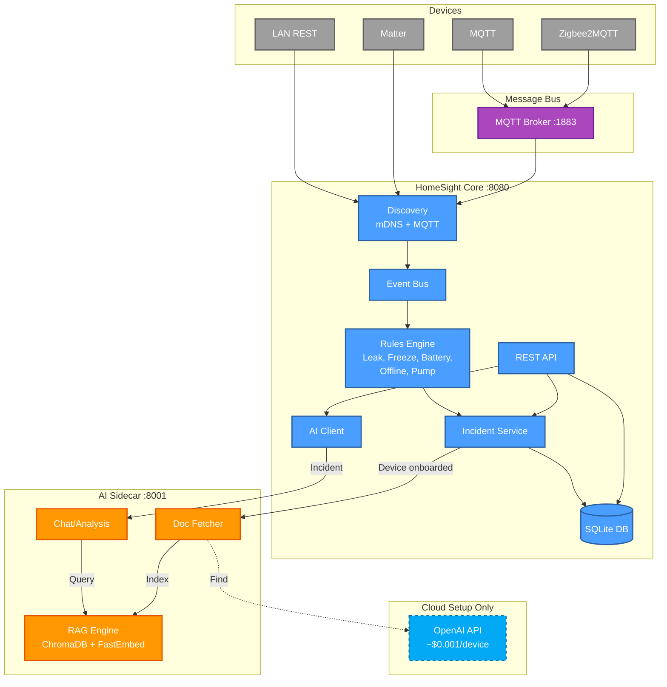

# HomeSight

Local-only home monitoring system. Detects leaks, freeze risks, battery issues, and more.

## Quick Start

```bash
make build
./scripts/homesight.sh start
./scripts/homesight.sh dashboard
```

**Services**: `http://localhost:8080` (main) | `http://localhost:8001` (AI, optional)

## Auto-Discovery

Zero-config device discovery via mDNS and MQTT:

| Protocol | Discovery |
|----------|-----------|
| MQTT Brokers | mDNS (`_mqtt._tcp`) |
| Zigbee2MQTT | Via MQTT discovery |
| Matter | mDNS (`_matter._tcp`) |
| Shelly/Tasmota/ESPHome | HTTP discovery |
| LAN devices | mDNS (`_http._tcp`) |

Devices appear automatically in the dashboard. Onboard via UI or API.

Optional manual config in `config.yaml` if auto-discovery doesn't find devices.

## Demos

```bash
# Interactive demo (sensor lifecycle, incidents)
./scripts/demo-interactive.sh

# AI + RAG demo (if AI service running)
./scripts/demo-ai-intelligence.sh

# Cleanup
./scripts/cleanup-demo.sh
```

## AI Service (Optional)

Retrieval-Augmented Generation (RAG) for incident analysis.

**Flow:**

1. Device onboarded → AI service fetches manufacturer docs
2. PDFs cached locally and indexed into ChromaDB
3. Incidents query vector DB for relevant docs → LLM generates recommendations

**Auto-Fetch**: Uses OpenAI GPT-4o-mini to find manuals (~$0.001 per device, one-time)

**Offline**: All analysis runs locally. Cloud only used for initial doc discovery.

**Check status:**

```bash
curl http://localhost:8001/health
curl http://localhost:8001/rag/status
```

## API

Main service on `http://localhost:8080`:

```bash
# Health check
curl http://localhost:8080/health

# Devices
curl http://localhost:8080/devices
curl http://localhost:8080/devices/{id}

# Incidents
curl http://localhost:8080/incidents?status=open
curl http://localhost:8080/incidents/{id}
curl -X POST http://localhost:8080/incidents/{id}/resolve
```

## Architecture



### Core Components

- **MQTT Client**: Connects to external brokers (not embedded)
- **Discovery**: mDNS for brokers/devices + MQTT discovery listener
- **Integrations**: MQTT, Zigbee2MQTT, LAN (HTTP), Matter (discovery only)
- **Rules Engine**: Leak, freeze, battery, offline, pump cycle detection
- **SQLite DB**: Stores devices, sensors, incidents, tasks

### AI Service

**Local:** FastEmbed embeddings + ChromaDB vector DB (offline analysis)

**Cloud:** OpenAI GPT-4o-mini for doc discovery only (~$0.001 per device, one-time)

**Workflow:** Device onboarded → fetch docs → index locally → use for incident analysis

## Rules Engine

Auto-creates incidents for:

- **Leak Detection** - Water detected
- **Freeze Risk** - Temp < 35°F
- **Low Battery** - Level < 20%
- **Device Offline** - No updates
- **Sump Pump Cycles** - Excessive cycling

Auto-resolves when conditions clear.

## Installation

### Production (Recommended)

```bash
sudo bash scripts/install.sh
```

This downloads pre-built binaries from GitHub releases and sets up systemd services for production deployment.

To install a specific version:

```bash
HOMESIGHT_VERSION=v1.0.0 sudo bash scripts/install.sh
```

See [Installation Guide](INSTALL.md) for detailed instructions.

## Development

```bash
make build        # Build daemon and dashboard
make clean        # Clean artifacts
./scripts/homesight.sh start       # Start all services
./scripts/homesight.sh dashboard   # Open TUI dashboard
./scripts/homesight.sh logs daemon # View daemon logs
```

## CI/CD Pipeline

Automated build, test, and release process using GitHub Actions:

- **Binaries** built for Linux (amd64, arm64)
- **Tests** run with race condition detection
- **Code quality** verified with golangci-lint
- **Docker images** pushed to GitHub Container Registry
- **Releases** automatically created with binaries attached

See [CI/CD Documentation](CI-CD.md) for complete details.

## Configuration

Edit `config.yaml` for MQTT broker, database path, and integrations.

See `config.yaml.example` for defaults.

## Requirements

- Go 1.25+
- Python 3.10+ (for AI sidecar, optional)
- Docker (for containers)
- SQLite3
