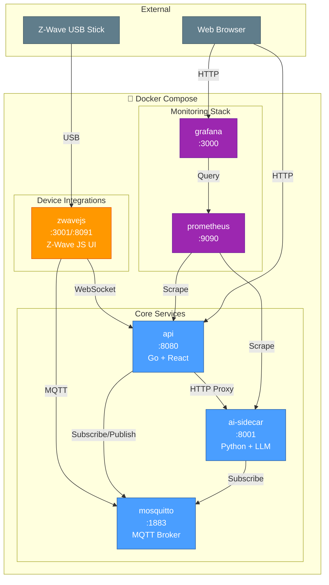
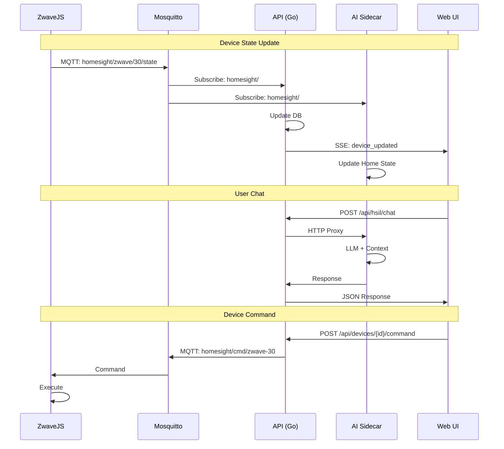
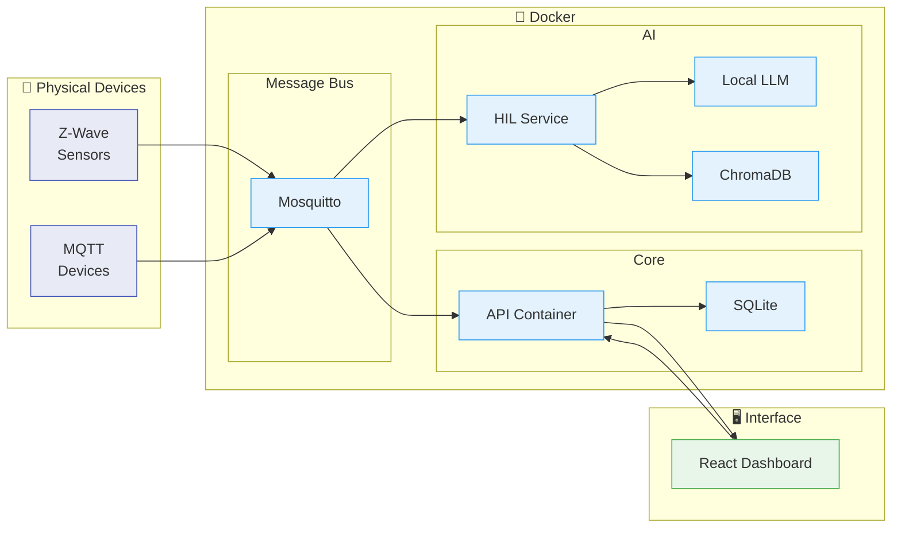
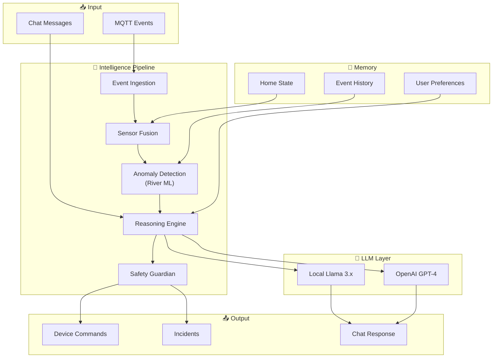

# HomeSight

**HomeSight** is a self-hosted, privacy-first home monitoring and intelligence platform. It runs entirely on your own hardware with no cloud dependencies, giving you complete control over your home data.

## What It Does

- 🚰 **Leak Detection** - Water sensors trigger instant alerts
- 🥶 **Freeze Prevention** - Temperature monitoring with risk warnings
- 🔋 **Battery Monitoring** - Track device battery levels, get low-battery alerts
- 📡 **Device Health** - Detect offline devices and connectivity issues
- 💧 **Sump Pump Tracking** - Monitor pump cycles and detect failures
- 🤖 **AI-Powered Chat** - Ask questions about your home in natural language
- 📚 **Smart Documentation** - Auto-fetches device manuals for troubleshooting

## Key Features

- **100% Local** - All data stays on your network. No cloud accounts required.
- **AI Intelligence** - Optional local LLM (Llama 3.x) for conversational interface
- **Z-Wave Support** - Native integration with Z-Wave devices via ZwaveJS
- **MQTT Architecture** - Extensible event-driven design for custom integrations
- **Real-time Dashboard** - React-based web UI with live updates
- **Incident Management** - Automatic incident creation and resolution

## Quick Start

```bash
# Build and start all services
./scripts/homesight.sh build
./scripts/homesight.sh start

# Check status
./scripts/homesight.sh status
```

**Services:**
| Service | Port | Description |
|---------|------|-------------|
| API | `:8080` | HomeSight Core REST API + Web UI |
| AI Sidecar | `:8001` | HIL Intelligence Layer |
| Mosquitto | `:1883` | MQTT Message Bus |
| ZwaveJS | `:3001` | Z-Wave WebSocket API |
| ZwaveJS UI | `:8091` | Z-Wave Admin Interface |
| Prometheus | `:9090` | Metrics Collection |
| Grafana | `:3000` | Dashboards |

## Architecture

HomeSight uses a **containerized microservices architecture** with all services running in Docker containers and communicating via MQTT message bus.

### Docker Services



### Service Communication



### Data Flow



## Docker Compose Services

### mosquitto - MQTT Message Bus
Eclipse Mosquitto broker for all inter-service communication.
- **Image:** `eclipse-mosquitto:2`
- **Ports:** `1883` (MQTT), `9001` (WebSocket)
- **Config:** `docker/mosquitto/mosquitto.conf`

### api - HomeSight Core
Go-based REST API with embedded React dashboard.
- **Image:** `homesight-api` (built from `docker/api/Dockerfile`)
- **Port:** `8080`
- **Features:** Device management, incidents, rules engine, SSE events
- **Mounts:** `config.yaml`, `/var/lib/homesight` (database)

### ai-sidecar - Intelligence Layer
Python-based AI service with local LLM support.
- **Image:** `homesight-ai-sidecar` (built from `docker/ai-sidecar/Dockerfile`)
- **Port:** `8001`
- **Features:** HIL pipeline, conversational agent, RAG, anomaly detection
- **GPU:** Vulkan acceleration via `/dev/dri`
- **Mounts:** LLM models, ChromaDB, manuals

### zwavejs - Z-Wave Integration
Z-Wave JS UI for Z-Wave device management.
- **Image:** `zwavejs/zwave-js-ui:latest`
- **Ports:** `3001` (WebSocket API), `8091` (Admin UI)
- **Device:** USB Z-Wave stick mounted at `/dev/zwave`

### prometheus & grafana - Monitoring
Metrics collection and visualization.
- **Prometheus:** `9090` - Scrapes API and AI sidecar metrics
- **Grafana:** `3000` - Dashboards (admin/admin)

## Management Commands

```bash
# Service Control
./scripts/homesight.sh start      # Start all services
./scripts/homesight.sh stop       # Stop all services
./scripts/homesight.sh restart    # Restart all services
./scripts/homesight.sh status     # Show service status

# Logs
./scripts/homesight.sh logs api   # API container logs
./scripts/homesight.sh logs ai    # AI sidecar logs
./scripts/homesight.sh logs mqtt  # Mosquitto logs
./scripts/homesight.sh logs zwave # ZwaveJS logs

# Build
./scripts/homesight.sh build      # Build Docker images
./scripts/homesight.sh rebuild    # Rebuild without cache

# Make targets
make docker-build                 # Build all images
make docker-rebuild               # Rebuild without cache
make docker-up                    # Start containers
make docker-stop                  # Stop containers
make docker-logs                  # Follow all logs
make status                       # Show status
```

## Configuration

### Environment Variables

The API container supports environment variable overrides for Docker networking:

| Variable | Default | Description |
|----------|---------|-------------|
| `MQTT_BROKER_URL` | `tcp://localhost:1883` | MQTT broker URL |
| `AI_SERVICE_URL` | `http://localhost:8001` | AI sidecar URL |
| `PROMETHEUS_URL` | `http://localhost:9090` | Prometheus URL |
| `ZWAVE_WEBSOCKET_URL` | `ws://localhost:3001` | ZwaveJS WebSocket |
| `HOMESIGHT_DB_PATH` | `/var/lib/homesight/homesight.db` | Database path |

### config.yaml

```yaml
database:
  path: /var/lib/homesight/homesight.db

mqtt:
  broker_url: "tcp://localhost:1883"

zwave:
  enabled: true
  websocket_url: "ws://localhost:3001"

ai:
  llm:
    chat_mode: "local"  # "local" or "cloud"
    local:
      model_path: "/home/homesight/models/llama-3.1-8b-instruct.gguf"
      n_ctx: 16384
      temperature: 0.3
```

## HIL (HomeSight Intelligence Layer)

The HIL is the brain of HomeSight - a multi-stage intelligence pipeline running in the AI sidecar container.



### Features

- **Sensor Fusion** - Combines multi-sensor data with weather & time context
- **Anomaly Detection** - Online ML (River) learns device patterns
- **Scenario Detection** - Pattern matching for leak, freeze, intrusion, etc.
- **Reasoning Templates** - Chain-of-thought for complex scenarios
- **Safety Guardian** - Validates all actions before execution
- **Conversational Agent** - Natural language interface to your home
- **RAG Pipeline** - Retrieves manufacturer docs for incident analysis

## Device Discovery

All devices are discovered via MQTT:

```
homesight/zwave/{nodeId}/discovery  → Device registration
homesight/zwave/{nodeId}/state      → State updates
homesight/cmd/zwave-{nodeId}        → Commands
```

**Supported Integrations:**
- **Z-Wave** - Via ZwaveJS WebSocket → MQTT bridge
- **Custom MQTT** - Any device publishing to `homesight/` topics

## Rules Engine

Auto-creates incidents for:
- **Leak Detection** - Water sensor triggered
- **Freeze Risk** - Temperature < 35°F
- **Low Battery** - Battery < 20%
- **Device Offline** - No updates for 24h
- **Sump Pump Cycles** - Excessive cycling

Incidents auto-resolve when conditions clear.

## Development

### Local Build (without Docker)

```bash
# Build Go binary
make build

# Run locally
./bin/homesightd

# Build web UI
cd web-ui && npm run build
```

### Docker Build

```bash
# Build all images
make docker-build

# Rebuild specific service
make docker-rebuild-api
make docker-rebuild-ai

# Quick rebuild + restart
make rebuild-quick
```

### Project Structure

```
homesight/
├── cmd/homesightd/        # Go API entrypoint
├── internal/              # Go packages
│   ├── api/               # REST API handlers
│   ├── db/                # SQLite repositories
│   ├── integrations/      # MQTT, Z-Wave bridges
│   └── rules/             # Rules engine
├── ai-sidecar/            # Python AI service
│   ├── hsil/              # HIL intelligence layer
│   ├── llm/               # LLM providers
│   ├── rag/               # RAG engine
│   └── services/          # API services
├── web-ui/                # React dashboard
├── docker/                # Dockerfiles & configs
│   ├── api/Dockerfile
│   ├── ai-sidecar/Dockerfile
│   └── mosquitto/mosquitto.conf
├── docker-compose.yml     # Service orchestration
├── config.yaml            # Runtime configuration
└── scripts/               # Management scripts
```

## Requirements

- **Docker** & **Docker Compose** (required)
- **Z-Wave USB Stick** (for Z-Wave devices)
- **GPU** (optional, for faster local LLM inference)

### Hardware Recommendations

| Component | Minimum | Recommended |
|-----------|---------|-------------|
| CPU | 4 cores | 8+ cores |
| RAM | 8 GB | 16+ GB |
| Storage | 20 GB | 50+ GB SSD |
| GPU | - | AMD/NVIDIA with Vulkan |

## License

MIT
