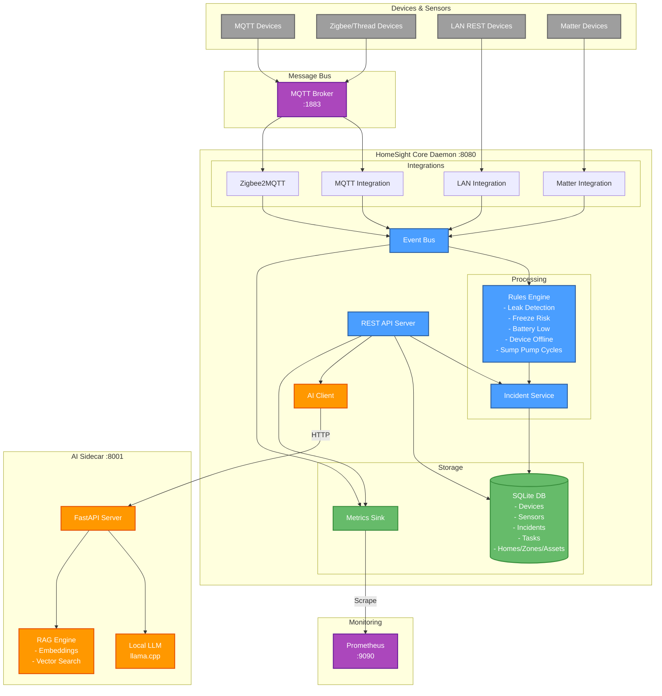

# HomeSight

HomeSight is a local-only home health and maintenance monitoring system for detecting leaks, monitoring sump pumps, freeze sensors, temperature sensors, and more.

## Architecture



**Components:**

- **Go Core Daemon** (`homesightd`): Main orchestrator and event processor
- **Python AI Sidecar**: Local LLM inference and RAG service
- **Prometheus**: Time-series metrics database (abstracted via interface)
- **MQTT Broker**: Message bus for sensors and devices
- **Zigbee2MQTT**: Zigbee and Thread device support
- **SQLite**: Local database for devices, incidents, and configuration
- **systemd**: Service supervision

## Design Principles

- **Interface-first**: All subsystems use Go interfaces for testability
- **Local-only**: No cloud dependencies
- **Go for orchestration**: Python only for LLM/AI workloads
- **Modular**: Each component is independently testable
- **Resilient**: Handles sensor outages, restarts, and partial failures

## Project Structure

```
homesight/
├── cmd/
│   └── homesightd/        # Main daemon entry point
├── internal/
│   ├── api/               # REST API server
│   ├── ai/                # AI client (calls Python sidecar)
│   ├── config/            # Configuration management
│   ├── db/                # SQLite repositories
│   ├── integrations/      # Device integrations (Matter, Zigbee, MQTT, LAN)
│   ├── events/            # Event bus
│   ├── metrics/           # Metrics sink (Prometheus abstraction)
│   ├── rules/             # Rules engine
│   ├── incidents/         # Incident management
│   ├── model/             # Core domain models
│   └── system/            # System utilities
├── pkg/
│   └── common/            # Shared utilities
├── ai-sidecar/            # Python AI service
├── scripts/               # Setup and deployment scripts
├── systemd/               # systemd service files
└── docs/                  # Documentation
```

## Quick Start

See [QUICKSTART.md](QUICKSTART.md) for detailed setup instructions.

### One-Command Control

```bash
# Start everything (daemon + AI + Docker services)
./scripts/homesight.sh start

# Stop everything
./scripts/homesight.sh status

# Check status
./scripts/homesight.sh status

# View logs
./scripts/homesight.sh logs daemon
./scripts/homesight.sh logs ai
```

### Prerequisites

- Go 1.25+
- Python 3.10+
- Docker & Docker Compose
- SQLite3 (included)

### Build & Run

```bash
# Build
make build

# Start all services
./scripts/homesight.sh start

# Test the API
curl http://localhost:8080/health
curl http://localhost:8080/devices
curl http://localhost:8080/incidents
```

## Scripts

- `homesight.sh` - Main control script (start/stop/restart/status)
- `build.sh` - Build the Go binary
- `verify.sh` - Verify installation and dependencies
- `install.sh` - Install system-wide with systemd

## Configuration

Configuration is stored in `config.yaml` (development) or `/etc/homesight/config.yaml` (production).

## Documentation

- [QUICKSTART.md](QUICKSTART.md) - Getting started guide
- [ARCHITECTURE.md](docs/ARCHITECTURE.md) - System architecture
- [DEVELOPMENT.md](docs/DEVELOPMENT.md) - Development guide
- [API.md](docs/API.md) - API reference

## License

MIT
