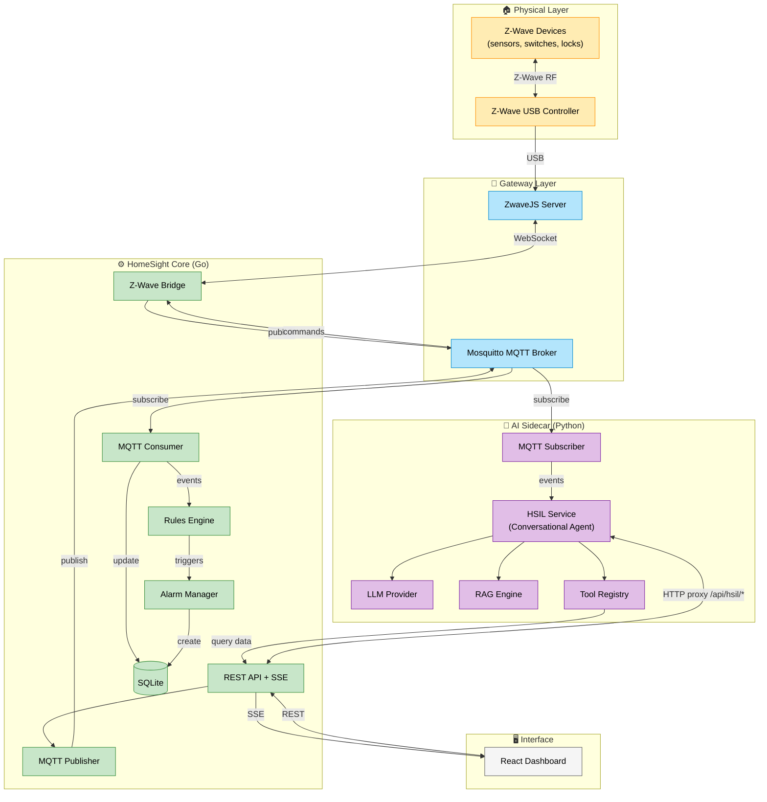
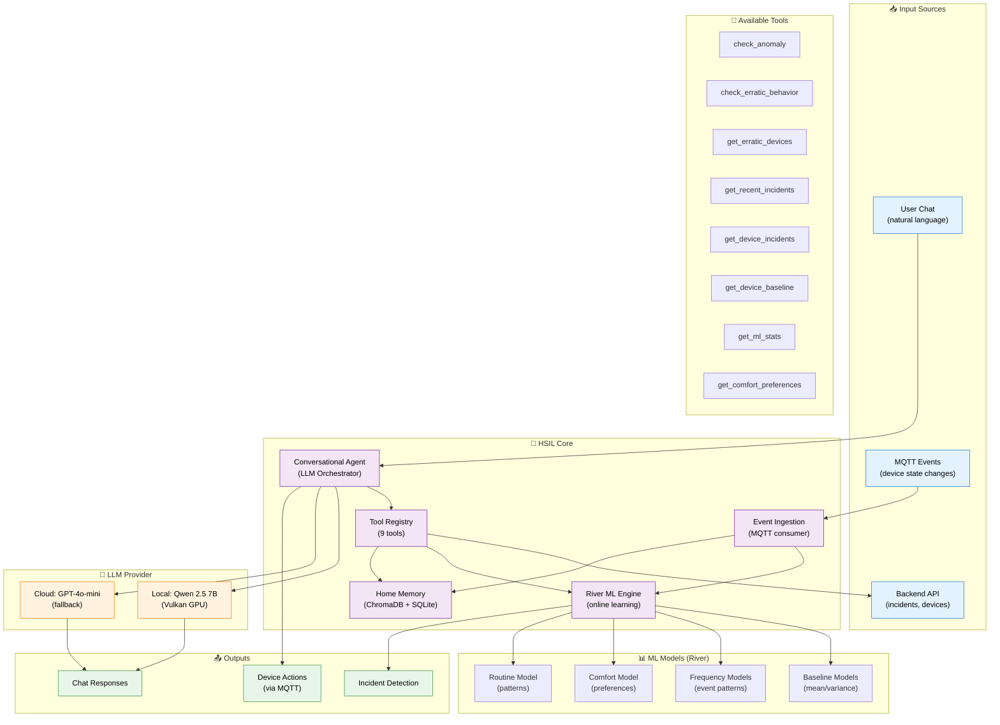
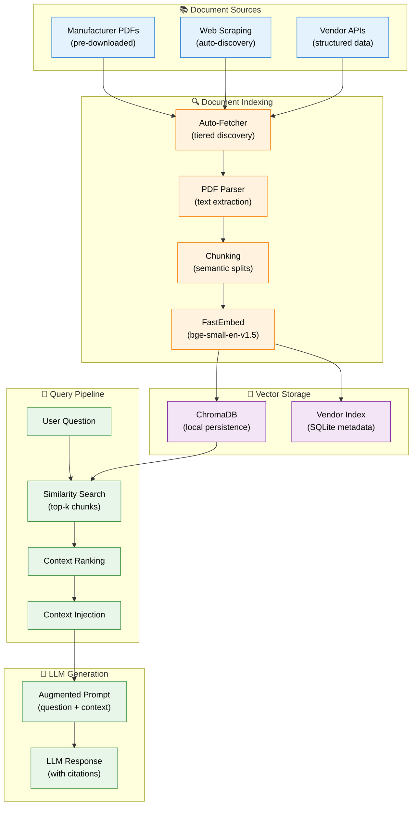

# HomeSight

**HomeSight** is a self-hosted, privacy-first home monitoring and intelligence platform. It runs entirely on your own hardware with no cloud dependencies, giving you complete control over your home data.

## What It Does

- 🚰 **Leak Detection** - Water sensors trigger instant alerts
- 🔋 **Battery Monitoring** - Track device battery levels, get low-battery alerts
- 📡 **Device Health** - Detect offline devices and connectivity issues
- 🤖 **AI-Powered Chat** - Ask questions about your home in natural language
- 📚 **Smart Documentation** - Auto-fetches device manuals for troubleshooting

## Key Features

- **100% Local** - All data stays on your network. No cloud accounts required.
- **AI Intelligence** - Optional local LLM (Llama 3.x) for conversational interface
- **Z-Wave Support** - Native integration with Z-Wave devices via ZwaveJS
- **MQTT Architecture** - Extensible event-driven design for custom integrations
- **Real-time Dashboard** - React-based web UI with live updates
- **Incident Management** - Automatic incident creation and resolution

## Quick Start

```bash
# Build and start all services
./scripts/homesight.sh build
./scripts/homesight.sh start

# Check status
./scripts/homesight.sh status
```

**Services:**

| Service | Port | Description |
|---------|------|-------------|
| API | `:8080` | HomeSight Core REST API + Web UI |
| AI Sidecar | `:8001` | HSIL Intelligence Layer |
| Mosquitto | `:1883` | MQTT Message Bus |
| ZwaveJS | `:3001` | Z-Wave WebSocket API |
| ZwaveJS UI | `:8091` | Z-Wave Admin Interface |
| Prometheus | `:9090` | Metrics Collection |
| Grafana | `:3000` | Dashboards |

## Architecture

HomeSight is built as a **modular, event-driven system** with clear separation between device communication, core logic, and intelligence layers.

### System Overview



### Component Descriptions

| Component | Language | Responsibility |
|-----------|----------|----------------|
| **ZwaveJS** | Node.js | Z-Wave protocol translation, device interview, mesh management |
| **Mosquitto** | C | MQTT message broker - central pub/sub bus for all services |
| **Z-Wave Bridge** | Go | Connects to ZwaveJS WebSocket, publishes events to MQTT, handles commands |
| **MQTT Consumer** | Go | Subscribes to `homesight/#`, updates DB, triggers rules engine |
| **MQTT Publisher** | Go | Publishes device commands to MQTT topics |
| **REST API** | Go | HTTP endpoints, SSE streaming, proxies AI requests |
| **Rules Engine** | Go | Evaluates alarm conditions from events |
| **Alarm Manager** | Go | Incident lifecycle (create, auto-resolve) |
| **SQLite** | - | Device state, incidents, zones, knowledge base |
| **HSIL Service** | Python | LLM-as-Orchestrator with online ML (River), anomaly detection, tool registry |
| **Conversational Agent** | Python | Natural language interface with 9 specialized tools |
| **LLM Provider** | Python | Hybrid: Qwen 2.5 7B (local + Vulkan GPU) or GPT-4o-mini (cloud) |
| **RAG Engine** | Python | ChromaDB vector search with FastEmbed for device documentation |
| **React Dashboard** | TypeScript | Real-time web UI with SSE updates |

### Key Design Principles

1. **External MQTT Broker** - Go and Python services are *clients* that connect to Mosquitto (they don't run MQTT themselves)
2. **Bridge Pattern** - Z-Wave Bridge translates ZwaveJS WebSocket events to MQTT messages
3. **Event-Driven** - All state changes flow through MQTT, any service can subscribe
4. **HTTP Proxy** - Go API is the single entry point; it proxies `/api/hsil/*` to the AI sidecar
5. **Local-First** - No cloud dependencies; runs entirely on your hardware

---

## Deployment

HomeSight runs as **Docker containers** orchestrated by Docker Compose. All services communicate via the internal `homesight` bridge network.

### Docker Compose Services

### mosquitto - MQTT Message Bus

Eclipse Mosquitto broker for all inter-service communication.

- **Image:** `eclipse-mosquitto:2`
- **Ports:** `1883` (MQTT), `9001` (WebSocket)
- **Config:** `docker/mosquitto/mosquitto.conf`

### api - HomeSight Core

Go-based REST API with embedded React dashboard.

- **Image:** `homesight-api` (built from `docker/api/Dockerfile`)
- **Port:** `8080`
- **Features:** Device management, incidents, rules engine, SSE events
- **Mounts:** `config.yaml`, `/var/lib/homesight` (database)

### ai-sidecar - Intelligence Layer

Python-based AI service with HSIL (HomeSight Intelligence Layer).

- **Image:** `homesight-ai-sidecar` (built from `docker/ai-sidecar/Dockerfile`)
- **Port:** `8001`
- **Features:** HSIL orchestrator, River ML, conversational agent, RAG, 9 specialized tools
- **GPU:** Vulkan acceleration via `/dev/dri` for local LLM
- **Mounts:** LLM models (Qwen 2.5 7B), ChromaDB, device manuals

### zwavejs - Z-Wave Integration

Z-Wave JS UI for Z-Wave device management.

- **Image:** `zwavejs/zwave-js-ui:latest`
- **Ports:** `3001` (WebSocket API), `8091` (Admin UI)
- **Device:** USB Z-Wave stick mounted at `/dev/zwave`

### prometheus & grafana - Monitoring

Metrics collection and visualization.

- **Prometheus:** `9090` - Scrapes API and AI sidecar metrics
- **Grafana:** `3000` - Dashboards (admin/admin)

## Management Commands

```bash
# Service Control
./scripts/homesight.sh start      # Start all services
./scripts/homesight.sh stop       # Stop all services
./scripts/homesight.sh restart    # Restart all services
./scripts/homesight.sh status     # Show service status

# Logs
./scripts/homesight.sh logs api   # API container logs
./scripts/homesight.sh logs ai    # AI sidecar logs
./scripts/homesight.sh logs mqtt  # Mosquitto logs
./scripts/homesight.sh logs zwave # ZwaveJS logs

# Build
./scripts/homesight.sh build      # Build Docker images
./scripts/homesight.sh rebuild    # Rebuild without cache

# Make targets
make docker-build                 # Build all images
make docker-rebuild               # Rebuild without cache
make docker-up                    # Start containers
make docker-stop                  # Stop containers
make docker-logs                  # Follow all logs
make status                       # Show status
```

## Configuration

### Environment Variables

The API container supports environment variable overrides for Docker networking:

| Variable | Default | Description |
|----------|---------|-------------|
| `MQTT_BROKER_URL` | `tcp://localhost:1883` | MQTT broker URL |
| `AI_SERVICE_URL` | `http://localhost:8001` | AI sidecar URL |
| `PROMETHEUS_URL` | `http://localhost:9090` | Prometheus URL |
| `ZWAVE_WEBSOCKET_URL` | `ws://localhost:3001` | ZwaveJS WebSocket |
| `HOMESIGHT_DB_PATH` | `/var/lib/homesight/homesight.db` | Database path |

### config.yaml

```yaml
database:
  path: /var/lib/homesight/homesight.db

mqtt:
  broker_url: "tcp://localhost:1883"

zwave:
  enabled: true
  websocket_url: "ws://localhost:3001"

ai:
  llm:
    chat_mode: "local"  # "local" or "cloud"
    local:
      model_path: "/home/homesight/models/llama-3.1-8b-instruct.gguf"
      n_ctx: 16384
      temperature: 0.3
```

## HSIL (HomeSight Intelligence Layer)

The HSIL is an AI-powered intelligence system running in the AI sidecar container. It uses LLM-as-Orchestrator pattern with online machine learning for real-time home intelligence.



### HSIL Features

- **LLM-as-Orchestrator** - LLM selects tools, tools execute deterministically, LLM synthesizes results (inspired by [Anthropic's tool use patterns](https://docs.anthropic.com/en/docs/build-with-claude/tool-use))
- **Online Learning (River)** - Incremental ML models learn patterns without batch retraining ([River ML framework](https://riverml.xyz/))
- **Anomaly Detection** - Detects unusual sensor readings based on learned baselines
- **Erratic Behavior Detection** - Identifies devices with rapid-fire events or unusual frequencies
- **Conversational Interface** - Natural language queries about home state, incidents, and device history
- **Tool-Based Architecture** - 9 specialized tools for device queries, ML stats, and incident history
- **Hybrid LLM** - Local Qwen 2.5 7B with GPU acceleration, cloud GPT-4o-mini fallback
- **Persistent Memory** - SQLite for structured data, ChromaDB for semantic embeddings

### References

HSIL architecture is built on researched patterns:

- **LLM Tool Use**: Schick et al. (2024), "[Toolformer: Language Models Can Teach Themselves to Use Tools](https://arxiv.org/abs/2302.04761)", arXiv:2302.04761
- **Online Machine Learning**: Montiel et al. (2021), "[River: machine learning for streaming data in Python](https://jmlr.org/papers/v22/20-1380.html)", JMLR 22(110):1−8
- ["According to . . . ": Prompting Language Mode](https://arxiv.org/html/2305.13252)

## RAG (Retrieval-Augmented Generation)

The RAG engine fetches and indexes device documentation to provide context-aware troubleshooting.



### RAG Features

- **Local Embeddings** - FastEmbed (bge-small-en-v1.5) runs offline, no API calls
- **Auto-Discovery** - Tiered pipeline finds manuals from manufacturer domains
- **Vendor Index** - SQLite tracks document metadata, refresh schedules
- **Semantic Search** - ChromaDB vector similarity for context retrieval
- **Offline-First** - All models and documents stored locally

## Device Discovery

All devices are discovered via MQTT:

```
homesight/zwave/{nodeId}/discovery  → Device registration
homesight/zwave/{nodeId}/state      → State updates
homesight/cmd/zwave-{nodeId}        → Commands
```

**Supported Integrations:**

- **Z-Wave** - Via ZwaveJS WebSocket → MQTT bridge
- **Custom MQTT** - Any device publishing to `homesight/` topics

## Rules Engine

Auto-creates incidents for:

- **Leak Detection** - Water sensor triggered
- **Freeze Risk** - Temperature < 35°F
- **Low Battery** - Battery < 20%
- **Device Offline** - No updates for 24h
- **Sump Pump Cycles** - Excessive cycling

Incidents auto-resolve when conditions clear.

## Development

### Local Build (without Docker)

```bash
# Build Go binary
make build

# Run locally
./bin/homesightd

# Build web UI
cd web-ui && npm run build
```

### Docker Build

```bash
# Build all images
make docker-build

# Rebuild specific service
make docker-rebuild-api
make docker-rebuild-ai

# Quick rebuild + restart
make rebuild-quick
```

## Requirements

- **Docker** & **Docker Compose** (required)
- **Z-Wave USB Stick** (for Z-Wave devices)
- **GPU** (optional, for faster local LLM inference)

### Hardware Recommendations

| Component | Minimum | Recommended |
|-----------|---------|-------------|
| CPU | 4 cores | 8+ cores |
| RAM | 8 GB | 16+ GB |
| Storage | 20 GB | 50+ GB SSD |
| GPU | - | AMD/NVIDIA with Vulkan |

## License

MIT
