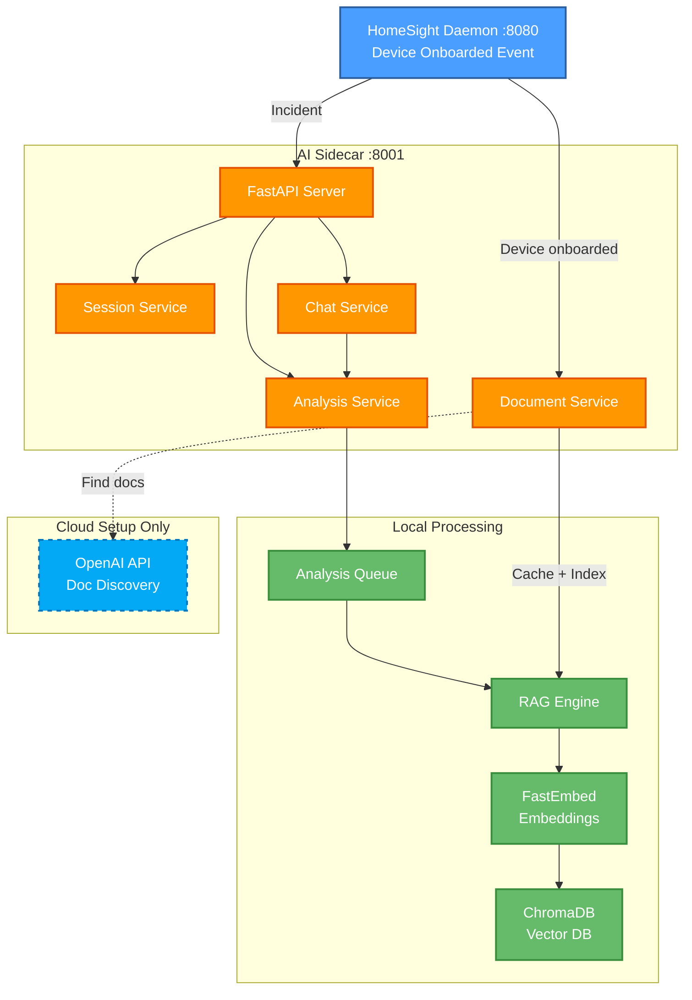

# HomeSight AI Sidecar

Optional Python service for RAG-powered incident analysis and chat.

## Quick Start

```bash
cd ai-sidecar
python3 -m venv venv
source venv/bin/activate
pip install -r requirements.txt
python main.py
```

Service runs on `http://localhost:8001`

## How It Works

1. **Incident Analysis**: Main daemon sends incidents → AI service provides recommendations
2. **Document Fetching**: When devices are onboarded, OpenAI finds and caches manufacturer docs
3. **RAG Indexing**: PDFs embedded into ChromaDB vector database
4. **Semantic Search**: Incidents query vector DB for relevant docs → LLM generates recommendations

**Cloud**: Only used for doc discovery (OpenAI API)
**Local**: All embeddings, indexing, and analysis happen locally

## Endpoints

```bash
# Health check
curl http://localhost:8001/health

# RAG status (docs indexed)
curl http://localhost:8001/rag/status

# Chat
curl -X POST http://localhost:8001/chat \
  -H "Content-Type: application/json" \
  -d '{"message": "How do I prevent frozen pipes?"}'

# Analyze incident
curl -X POST http://localhost:8001/analyze \
  -H "Content-Type: application/json" \
  -d '{"type": "leak_detected", "severity": "critical"}'
```

## Architecture



## Configuration

See `config.py` for:

- OpenAI API key (for doc discovery)
- ChromaDB path
- Model selection
- RAG parameters

## Requirements

- Python 3.10+
- FastAPI, ChromaDB, FastEmbed
- (Optional) OpenAI API key for doc discovery
- (Optional) llama-cpp-python for local LLM
